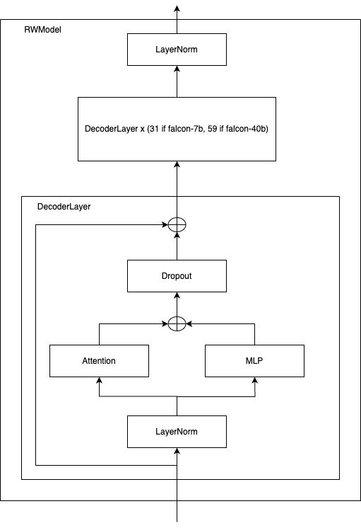

# falcon-llm

The falcon repos at HF, ex: https://huggingface.co/tiiuae/falcon-7b, is borked. This is fixed in the hf/transformers library (PR https://github.com/huggingface/transformers/pull/24523), but the fix is not in the latest release. This repo is a pure copy/fork of these Falcon models to use while we wait for transformers version 4.32.0. 

The 7b model in bfloat16 run in a A6000 (on a shared vm in a cloud): 
``` 
average time over 10 runs was 79.0291601896286, it produced 20410 tokens, which is 25.82591027290014 tokens/s 

run times: [89.18681359291077, 76.53192377090454, 76.69732713699341, 76.70143032073975, 76.80401158332825, 79.02443742752075, 78.81574034690857, 78.86228728294373, 78.78721976280212, 78.88041067123413]
``` 

## FalconForCasualLM architecture



For the 7b model:
``` 
FalconForCausalLM(
  (transformer): FalconModel(
    (word_embeddings): Embedding(65024, 4544)
    (h): ModuleList(
      (0-31): 32 x FalconDecoderLayer(
        (self_attention): FalconAttention(
          (maybe_rotary): FalconRotaryEmbedding()
          (query_key_value): FalconLinear(in_features=4544, out_features=4672, bias=False)
          (dense): FalconLinear(in_features=4544, out_features=4544, bias=False)
          (attention_dropout): Dropout(p=0.0, inplace=False)
        )
        (mlp): FalconMLP(
          (dense_h_to_4h): FalconLinear(in_features=4544, out_features=18176, bias=False)
          (act): GELU(approximate='none')
          (dense_4h_to_h): FalconLinear(in_features=18176, out_features=4544, bias=False)
        )
        (input_layernorm): LayerNorm((4544,), eps=1e-05, elementwise_affine=True)
      )
    )
    (ln_f): LayerNorm((4544,), eps=1e-05, elementwise_affine=True)
  )
  (lm_head): Linear(in_features=4544, out_features=65024, bias=False)
)
```